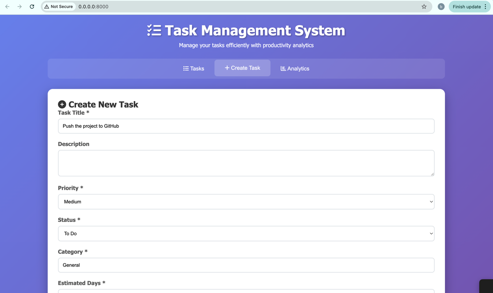
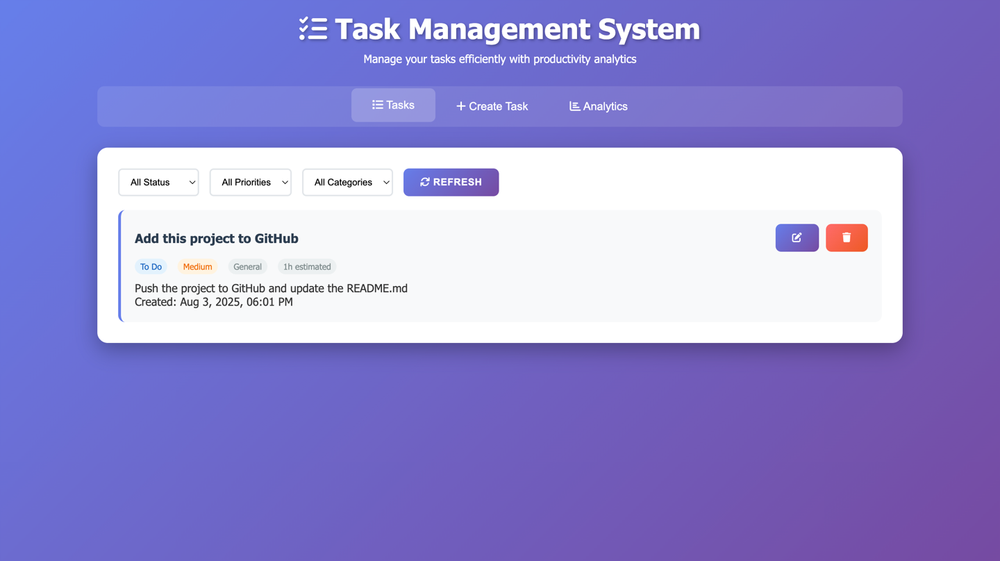
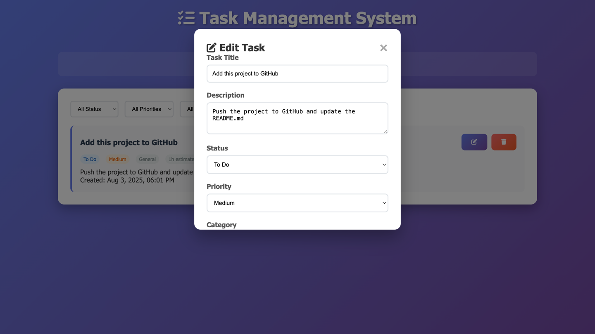
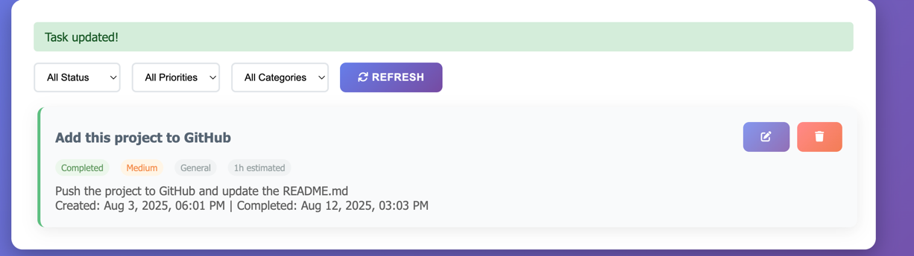
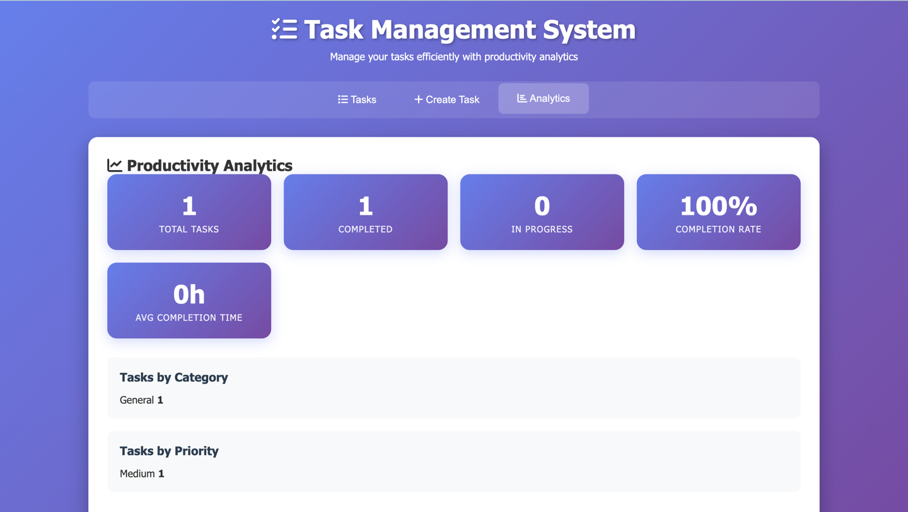

# Task Management System - Setup Guide

## Project Structure
```
task-management-system/
├── main.py                # Entry point to start the FastAPI app
├── init_db.py             # Script to initialize the database (run once)
├── fronted/               # Frontend interface (HTML, CSS, JS)
│   ├── index.html         # Main user interface
│   └── static/
│       ├── css/
│       │   └── styles.css # Styling for the UI
│       └── js/
│           └── app.js     # JavaScript to handle frontend logic and API calls
├── app/                   # Backend application package
│   ├── routers/           # API route handlers
│   │   ├── tasks.py       # Routes for task CRUD operations
│   │   ├── categories.py  # Routes to manage task categories
│   │   └── analysis.py    # Routes for analytics and statistics
│   ├── models.py          # SQLAlchemy models for DB tables
│   ├── schemas.py         # Pydantic schemas for request/response validation
│   ├── database.py        # Database connection and session setup
│   └── __init__.py        # Marks `app` as a Python package
├── tasks.db               # SQLite database file (auto-created)
├── requirements.txt       # Python dependencies list
└── README.md              # Project documentation
```
---
## 🚀 Features
-  **Create, update, delete tasks**
-  **Track task completion with timestamps**
-  **Filter tasks by status, priority, or category**
-  **Simple HTML + JS dashboard**

---

## 🛠️ Tech Stack
- **Backend:** FastAPI, SQLAlchemy, PostgreSQL
- **Frontend:** Vanilla JS + HTML + CSS
- **Database:** PostgreSQL
- **ORM:** SQLAlchemy (sync)
- **Dev Tools:** Uvicorn, Alembic (optional)

---

## Requirements (requirements.txt)
```
SQLAlchemy~=2.0.42
pydantic~=2.11.7
python-dotenv~=1.1.1
asyncpg~=0.30.0
fastapi~=0.116.1
```
---

## Installation & Setup

### 1. Clone the repo
```bash
git clone https://github.com/your-username/task-manager-dashboard.git
cd task-manager-dashboard
```

### 2. Set up the virtual environment
```bash
python -m venv venv
source venv/bin/activate  # On Windows: venv\Scripts\activate
pip install -r requirements.txt
```

### 3. Install Dependencies
```bash
pip install -r requirements.txt
```

### 4. Set up the PostgreSQL database
```bash
CREATE DATABASE tasks_db;
```

### 5. Run the Application
```bash
uvicorn app.main:app --reload
```

## API Endpoints

### Tasks
- `GET /tasks/` - Get all tasks (with optional filters)
- `POST /tasks/` - Create a new task
- `GET /tasks/{task_id}` - Get a specific task by ID
- `PUT /tasks/{task_id}` - Update a task
- `DELETE /tasks/{task_id}` - Delete a task

### Analytics
- `GET /analytics/` - Get productivity analytics
- `GET /categories/` - Get all task categories

### Query Parameters for GET /tasks/
- `status`: Filter by status (todo, in_progress, completed)
- `priority`: Filter by priority (low, medium, high)
- `category`: Filter by category name

---
## SCreenShots
Start by adding a new task:


Then you can view your tasks in the “Tasks” list:


You can also update any task fields:


If you mark a task as In Progress, the start time will automatically be set to the current time.
If you mark a task as Completed, the completed_at field will automatically display the time of completion:


You can also track your progress in the “Analysis” section:


---

## 👤 Author

Bothaina Karakrah – [LinkedIn](https://www.linkedin.com/in/bothaina-karakrah-57458219a/)

License: MIT